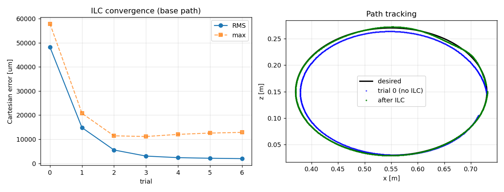
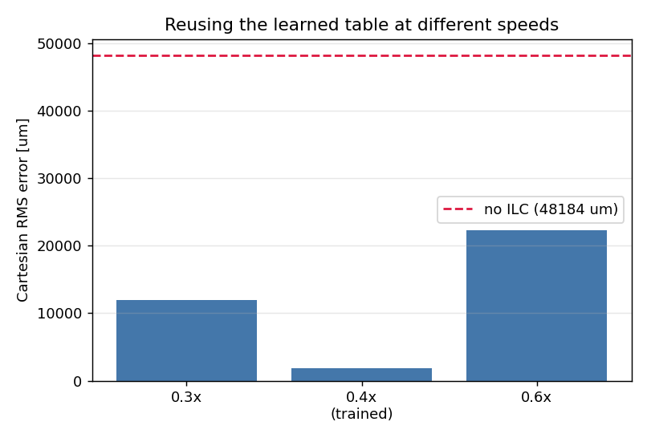
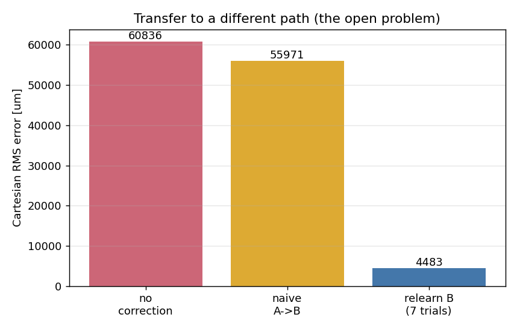
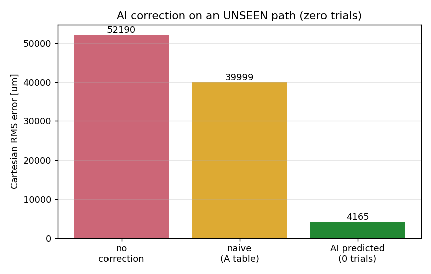

# Path-ILC + a learned correction-transfer layer (MuJoCo demo)

A small, fully runnable study of the control idea behind the **ACIN / TU Wien**
PhD project *"AI-Enhanced High-Accuracy Robotics for Industrial Applications."*
It re-implements the **path-parameter iterative learning controller (ILC)** of
Schwegel & Kugi (ICRA 2024) on a simulated robot, then prototypes the project's
stated open problems: generalizing a learned correction to **new paths**,
handling **contact** tasks, and putting an **AI layer on top of the classical
ILC** for effects a fixed table can't capture (e.g. thermal drift).

> This is a **conceptual demonstrator**, not a finished solution. The
> [Honest limitations](#honest-limitations-read-this) section is the most
> important part of this file — please read it.

### Reference papers (in [`papers/`](papers/))
- **Schwegel & Kugi (ICRA 2024)** — *A Simple, Computationally Efficient Path-ILC
  for Industrial Robotic Manipulators* — the method this repo re-implements
  ([`papers/A_Simple_Computationally_Efficient_Path_ILC_for_Industrial_Robotic_Manipulators.pdf`](papers/A_Simple_Computationally_Efficient_Path_ILC_for_Industrial_Robotic_Manipulators.pdf)).
- *A Path/Surface-Following Control Approach to Generate Virtual Fixtures* —
  background on path-indexed control
  ([`papers/A_Path_Surface_Following_Control_Approach_to_Generate_Virtual_Fixtures.pdf`](papers/A_Path_Surface_Following_Control_Approach_to_Generate_Virtual_Fixtures.pdf)).
- **PhD position description** — the three project goals this repo targets
  ([`papers/PhD_Position_Industrial-Robotics_AI-Enhanced-High-Accuracy-Robotics-for-Industrial-Applications.pdf`](papers/PhD_Position_Industrial-Robotics_AI-Enhanced-High-Accuracy-Robotics-for-Industrial-Applications.pdf)).

---

## See it move first

The KUKA iiwa14 traces a 3D path and leaves a tool-tip **trace** — **red before
ILC**, **green after ILC**. Because the real error is only millimetre-scale on a
~1 m arm, the deviation from the desired path is **amplified ×8** so it is
visible (the same trick as the paper's Fig. 4, which amplifies ×50). The red
trace balloons off the yellow path; the green hugs it.

| Free-space tracking | Contact task (tool pressed on a worktable) |
|---|---|
|  |  |

### Mission-control dashboard (learning, live)

A 4-panel animation of the whole learning process across trials 0→4: the moving
arm, the TCP error vs path parameter λ (past trials fading as it collapses), the
seven ILC feed-forward signals being applied, and the convergence curve filling
in trial by trial.

<video src="outputs/kuka_dashboard.mp4" controls width="100%"></video>

> ▶️ [`outputs/kuka_dashboard.mp4`](outputs/kuka_dashboard.mp4) — GitHub renders
> the `<video>` tag inline once the repo is pushed; locally, open the file
> directly.

---

## What this is, in one minute

Re-implement the ACIN path-ILC faithfully on a **real KUKA iiwa14** whose joints
are modelled as torsional **spring–mass–dampers** with realistic drivetrain
error (transmission error, Stribeck friction, backlash, thermal drift, encoder
noise). Then go past the paper on its own stated open problems:

1. **Learn the correction from joint-side encoders only — no laser tracker**
   (the paper *needed* a Leica laser tracker to learn). `p2` validates the
   encoders are a faithful proxy for true TCP accuracy.
2. **Generalize the correction to an unseen path with zero trials** via a small
   learned model on top of the ILC (`k4`).
3. **A temperature-aware AI layer** predicts the thermal-drift compensation a
   fixed ILC table cannot (`r4`, `r5`) — the "AI-enhanced" part.

It is simulation, and the limitations section is explicit about what that does
and does not prove.

## Relation to the paper — what's faithful, what's new

The paper ran a path-λ PD-ILC with a Gaussian Q-filter on a real 6-axis Comau
robot, using a **Leica laser tracker** to measure the true TCP and learn the
residual transmission/elastic error. It achieved **95% error reduction in two
trials**, reused the learned table across execution speeds, and learned from
partial trials. Its conclusion lists four **open problems**: combine a
*model-based learning filter* with the ILC, improve *speed-variation*
performance, handle *contact* tasks, and *generalize learned data to different
paths*. This repo re-implements the ILC faithfully, then targets exactly those.

| Aspect | Paper (ICRA 2024) | This repo |
|---|---|---|
| ILC algorithm | path-λ PD-ILC + Gaussian Q-filter (eqs. 10, 14–16, 19) | **same**, faithfully re-implemented (`src/ilc.py`) |
| Error source | real Comau drivetrain | KUKA iiwa14 with **modeled flexible joints** (motor+link+spring), params chosen by us |
| Feedback used **to learn** | **laser tracker** → joints (eq. 12) | **joint-side encoders only, no tracker** — *PhD goal 1* |
| Convergence | 95% in 2 trials | ~**32×** RMS (free-space), ~**17×** (contact) |
| Speed transfer | near-perfect (computed-torque) | shown but **partial** (weaker control — honest) |
| Path → path transfer | *open problem* | **AI predicts a correction for an unseen path, 0 trials** — *new* |
| Model-based learning filter | *open problem* | the **learned net on top of the ILC** is exactly this — *new* |
| Contact tasks | *open problem* | **tool-on-worktable task, ILC ~17×** — *new* |
| Platform | real hardware | **simulation** (see *Honest limitations*) |

## The two demonstrators

Both arms share the **same** ILC (`src/ilc.py`) and AI layer (`src/ai.py`):

1. **Toy 3-DOF planar arm** (`src/main.py`, `src/view.py`) — zero external files,
   runs in seconds, good for a quick sanity check.
2. **Real KUKA iiwa14** (`src/main_kuka.py`, `src/view_kuka.py`) — the actual
   7-DOF industrial arm from the MuJoCo Menagerie (real meshes, masses, inertias),
   with **flexible joints** added: every axis is split into a motor DOF and a link
   DOF joined by a torsional **spring + damper**. The motor turns to the commanded
   angle but the link deflects under gravity/motion — this is genuine **joint
   elasticity / transmission error**, the dominant drivetrain error the PhD
   targets. The controller plans on the *rigid* model and never sees the springs;
   the ILC learns the correction from **joint-side encoders only** (no laser
   tracker). See `src/kuka.py` for the construction.

> The headline KUKA experiments run **under realistic repeatable effects**
> (transmission error + Stribeck friction + backlash + encoder noise); the
> numbers below hold up, showing the method is robust to them. Thermal drift is
> non-repetitive and is studied separately (see *Realistic drivetrain model*).

---

## KUKA headline results

```bash
python src/main_kuka.py            # experiments 1–4  → k1–k4 (~40 s)
python src/main_kuka_contact.py    # contact task     → k5
```

### 1. Convergence — *Goal 1: learn without a laser tracker*

ILC converges using **joint-side encoders only**: **34 mm → ~1.06 mm RMS (~32×)**,
most of it in the first 2–3 trials, just like the paper's "95% in two trials."


### 2. Speed transfer — *honest: partial*

The path-λ table is reused at other speeds with no relearning. It beats no-ILC
everywhere but is clearly **best at the trained speed (≈0.99 mm)** — a
velocity-dependent residual a position-indexed table cannot fully cancel, which
is exactly the paper's stated open issue.


### 3. Path transfer — *the open problem*

A table learned on path A barely helps on path B; full relearning works but
costs fresh trials: **no-corr 42 mm → naive-reuse 14 mm → full relearn 1.66 mm**.


### 4. AI layer — *Goal 2: generalize to a new path, zero trials*

A small network is trained on ILC-converged tables for a range of path shapes,
then predicts a correction for a path it has **never seen**, with **zero trials**:
**no-corr 35 mm → naive 5.7 mm → AI-predicted 1.46 mm**. The learned layer
recovers, instantly, the accuracy classical ILC only reaches by running fresh
trials on the new path.


### 5. Contact task — *the paper's open problem*

```bash
python src/main_kuka_contact.py
```

The tool tip is dragged along a circle while **pressing on a worktable (~110 N**,
from gravity on the flexible arm). Sliding friction + joint elasticity create a
repeatable in-plane disturbance, and the **same** path-ILC learns to cancel it:
**18 mm → 1.06 mm RMS (~17×)**. The max error plateaus ~9 mm at the friction
stick–slip reversal — honest: a position-indexed ILC cannot perfectly cancel a
discontinuous friction flip.


| Experiment | Result (Cartesian RMS at TCP) |
|---|---|
| **1. Convergence** (encoders only) | 33965 → 1054 µm (**~32×**) |
| **2. Speed transfer** | best at trained speed (≈990 µm); partial elsewhere |
| **3. Path transfer** | no-corr 41865 → naive 14006 → relearn 1651 µm |
| **4. AI, unseen path, 0 trials** | no-corr 34401 → naive 5421 → **AI 1556 µm** |
| **5. Contact task** | 17586 → 1060 µm (**~17×**) under ~110 N press |

Numbers vary slightly run-to-run (ML + physics); reproducible on a fixed machine
with the pinned versions in `requirements.txt`.

---

## Publication-quality analysis figures

```bash
python src/figures_kuka.py         # p1–p4
```

These read like control-research figures, not toy plots.

### `p1` — paper-style reproduction (the paper's Fig. 5)

TCP error components, the seven ILC input signals, and path speed over 7 trials,
with **trial 5 = ILC OFF** (error returns) and **trial 6 = ILC ON** (error
vanishes again).


### `p2` — the *no-tracker* validation ("is this circular?")

Joint-side encoder RMS and true TCP RMS fall in **lock-step (corr ≈ 0.97)**, so
minimising what the encoders see also minimises the true accuracy → **a laser
tracker is not needed to learn**. The second panel shows the learned feed-forward
reproducing the true drivetrain-error pattern (a ground truth only available in
simulation).


### `p3` — where the error lives along the path

Error vs path position, before vs after learning (log scale).


### `p4` — the mechanical-engineering view

Each joint is a torsional **spring–mass–damper**, with natural frequency
$f_n=\tfrac{1}{2\pi}\sqrt{K/J}$, damping ratio $\zeta=d/2\sqrt{KJ}$, the ILC
Q-filter cutoff, and a free vibration ring-down. This also explains the partial
speed transfer: faster motion excites frequencies nearer $f_n$, i.e. residual
*vibration* a position-indexed table cannot cancel.


---

## Realistic drivetrain model

```bash
python src/figures_realism.py      # r1–r5
```

Beyond joint elasticity, `kuka.Effects` adds the error sources of a real
high-accuracy industrial robot, grounded in the literature: gear/cycloidal
**transmission error**, **Stribeck/stick-slip friction**, **backlash/lost
motion**, **thermal drift**, and **encoder noise + quantization**. All are OFF by
default; `Effects.realistic()` turns them on. They are applied as joint
disturbance torques + encoder processing, and the ILC still only ever sees
joint-side encoders.

### `r1` — ablation: ILC stays ~1 mm under every effect

Repeatable effects (transmission error, backlash) are learned away; encoder
noise is filtered.


### `r2` — the Q-filter rejects encoder noise

Without the Gaussian Q-filter the learned correction is jagged (it learns noise).


### `r3` — the injected transmission error

Angle-periodic gear/cycloidal harmonics ("100×/rev", ~0.3–0.8 mrad).


### `r4` — why an adaptive/AI layer is needed

**Thermal drift defeats a frozen ILC table** (error creeps back up as the robot
warms), while an **online/self-learning ILC tracks it**. This is the key
motivation for an AI layer over a fixed correction — a non-repetitive effect (the
PhD's *temperature*) a frozen table cannot handle.


### `r5` — *Goal 3: the AI layer for thermal drift*

A temperature-aware model predicts the compensation at an **unseen** thermal
state, zero trials: **frozen 4.5 mm → AI 0.99 mm ≈ oracle 1.05 mm**.


### Thermal warm-up dashboard

Frozen vs online RMS diverging live as joint temperature rises.

<video src="outputs/kuka_thermal_dashboard.mp4" controls width="100%"></video>

See [`outputs/kuka_thermal_dashboard.mp4`](outputs/kuka_thermal_dashboard.mp4).

---

## Toy 3-DOF demonstrator

A 3-DOF planar arm in MuJoCo. The controller plans with an **ideal rigid
kinematic model**, but the plant has dynamics it does **not** know about — joint
friction, gravity loading, compliance. The mismatch produces a repeatable path
error, like the "unknown transmission error dynamics" the paper targets.
Crucially the error is **not** an injected formula: it emerges from the
model/plant gap, so the ILC must discover the correction from joint-encoder error
alone.

```bash
python src/main.py                 # experiments 1–4 → 1–4 figures
python src/view.py                 # → outputs/arm_tracking.gif
```


| Toy figure | Shows |
|---|---|
|  | **1. Convergence** — ~25× in a few trials, most in the first two |
|  | **2. Speed generalization** — table reused at other speeds (partial) |
|  | **3. Path transfer** — naive reuse barely helps; relearn works |
|  | **4. AI layer** — unseen path, 0 trials: 52190 → naive 39999 → **AI 4165 µm** |

The ILC is faithful to the paper: a PD-type update indexed by the **path
parameter** λ ∈ [0,1] (eq. 10) with the paper's gains `Kp_ilc = 1`, `Kd_ilc =
0.01`; a **Gaussian Q-filter** (eqs. 14–16, 19) smoothing the correction along
the path; the correction stored as a table over `N` path intervals, so lookup by
path position is what gives speed generalization.

---

## Honest limitations (read this)

- **It's a simulation.** The joint "encoder" is noise-free by default, so the
  *"learn without a laser tracker"* goal is shown **structurally** (only joint
  sensors are ever used; the true tip position is read for evaluation only, never
  fed to the ILC). It is **not** a solution to real-world sensing noise — though
  the optional `kuka.Effects` realistic mode adds encoder noise + quantization.
- **The error source is simplified.** Real drivetrain error depends on joint
  angle, load, temperature, and wear in ways no fixed model fully captures — that
  open difficulty is the actual research. Here the error comes from MuJoCo's
  friction/compliance/gravity (plus the modeled `Effects`); I chose the parameters.
- **Speed generalization is partial.** A position-indexed table cannot cancel a
  velocity-dependent residual. The paper's stiff industrial arm + computed-torque
  controller is dominated by *pose-dependent* error, which is why their speed
  transfer is much cleaner. The plot shows the honest behavior, not an idealized one.
- **The AI result is easy here.** With smooth paths the geometry→correction map
  is simple, so a small network suffices. The point is the *architecture and the
  experimental protocol* (train on real ILC-solved tables, test on an unseen
  geometry), not the difficulty of this instance.

---

## How to run

First-time setup (creates the virtual environment and installs deps):

```bash
python3 -m venv .venv && source .venv/bin/activate
pip install -r requirements.txt
```

Run **from the project root**. The `.venv` is already installed, so you can call
its Python directly (`.venv/bin/python ...`) or `source .venv/bin/activate` once
and use plain `python`.

### Easiest — regenerate everything

```bash
.venv/bin/python src/run_all.py            # all figures + GIFs + MP4s (~4–5 min)
.venv/bin/python src/run_all.py --quick    # figures/experiments only, skip videos (~100 s)
```

### Run individual pieces

```bash
python src/main_kuka.py            # KUKA headline experiments → k1–k4 (~40 s)
python src/main_kuka_contact.py    # contact task → k5
python src/figures_kuka.py         # paper-style / validation / vibration → p1–p4
python src/figures_realism.py      # realistic effects + thermal AI → r1–r5
python src/main.py                 # toy 3-DOF demo → 1–4
```

### Visuals (write a file, or open a window with `--live`)

```bash
python src/view_kuka.py            # → outputs/kuka_tracking.gif
python src/view_kuka.py --live     # interactive MuJoCo window
python src/view_kuka_contact.py    # → outputs/kuka_contact.gif
python src/view_kuka_contact.py --live
python src/dashboard_kuka.py       # → outputs/kuka_dashboard.mp4
python src/dashboard_thermal.py    # → outputs/kuka_thermal_dashboard.mp4
python src/view.py                 # toy arm → outputs/arm_tracking.gif
```

**Notes**
- Run from the project root, **not** from inside `src/`.
- The rendering scripts (`view_*`, `dashboard_*`) need a display/GL — they
  auto-set `MUJOCO_GL=glx`, which works on this machine. The experiment/figure
  scripts (`main_*`, `figures_*`) don't render, so they run anywhere.
- All outputs land in `outputs/`. See [`FIGURES.md`](FIGURES.md) for a one-line
  "which figure proves which claim" index with the key numbers.

---

## Files

| Path | What it is |
|---|---|
| `src/ilc.py` | the path-parameter PD-ILC with Gaussian Q-filter (paper eqs.) |
| `src/ai.py` | the small geometry→correction network |
| `src/arm.py` | toy MuJoCo plant with unmodeled dynamics + ideal FK/IK controller |
| `src/run.py` | toy path library and the trial-execution loop |
| `src/main.py` | toy: all four experiments → figures `1`–`4` |
| `src/view.py` | toy: visualize the arm tracing the path |
| `src/kuka.py` | **real KUKA iiwa14** plant with flexible joints + rigid control model; `kuka.Effects` config (transmission error / friction / backlash / thermal / encoder noise; all OFF by default, `.realistic()` enables all, `.realistic_repeatable()` all but thermal) |
| `src/run_kuka.py` | 3D path library, IK, and the KUKA trial loop |
| `src/main_kuka.py` | KUKA experiments → figures `k1`–`k4` |
| `src/view_kuka.py` | visualize the KUKA tracing a 3D path |
| `src/run_kuka_contact.py` | contact-task path + worktable/tool setup |
| `src/main_kuka_contact.py` | contact-task experiment → figure `k5` |
| `src/view_kuka_contact.py` | visualize the contact task |
| `src/figures_kuka.py` | analysis figures `p1`–`p4` (paper-style, no-tracker validation, vibration) |
| `src/figures_realism.py` | realistic-effects figures `r1`–`r5` (ablation, Q-filter, transmission error, thermal, thermal-AI) |
| `src/dashboard_kuka.py` | real-time learning dashboard MP4 |
| `src/dashboard_thermal.py` | thermal-drift adaptation dashboard MP4 |
| `src/run_all.py` | regenerate every result in one command (`--quick` skips videos) |
| `papers/` | the reference papers + PhD position description |
| `FIGURES.md` | figure index / talking-points sheet (claim + number per figure) |

`MuJoCo_tutorials-main/` is a third-party MuJoCo modeling tutorial kept only as a
learning reference; it inspired the contact-task idea but none of its files are
imported — the worktable and tool are built inline in `src/kuka.py`.
