# Path-ILC + a learned correction-transfer layer (MuJoCo demo)

A small, fully runnable study of a control idea for high-accuracy industrial
robotics. It re-implements the **path-parameter iterative learning controller
(ILC)** of Schwegel & Kugi (ICRA 2024) on a simulated robot, then prototypes
three open problems the paper itself lists as future work: generalizing a
learned correction to **new paths**, handling **contact** tasks, and putting an
**AI layer on top of the classical ILC** for effects a fixed table can't
capture (e.g. thermal drift).

> This is a **conceptual demonstrator**, not a finished solution. The
> [sensing assumption](#the-sensing-assumption-read-this-first) and
> [honest limitations](#honest-limitations) sections are the most important
> parts of this file — please read them before the results.

### Reference papers (in [`papers/`](papers/))
- **Schwegel & Kugi (ICRA 2024)** — *A Simple, Computationally Efficient Path-ILC
  for Industrial Robotic Manipulators* — the method this repo re-implements
  ([PDF](papers/A_Simple_Computationally_Efficient_Path_ILC_for_Industrial_Robotic_Manipulators.pdf)).
- *A Path/Surface-Following Control Approach to Generate Virtual Fixtures* —
  background on path-indexed control
  ([PDF](papers/A_Path_Surface_Following_Control_Approach_to_Generate_Virtual_Fixtures.pdf)).

---

## See it move

The KUKA iiwa14 traces a 3D path and leaves a tool-tip **trace** — **red before
ILC**, **green after ILC**. Because the real error is only millimetre-scale on a
~1 m arm, the deviation from the desired path is **amplified ×8** so it is
visible (the same trick as the paper's Fig. 4, which amplifies ×50). The red
trace balloons off the yellow path; the green hugs it.

| Free-space tracking | Contact task (tool pressed on a worktable) |
|---|---|
| 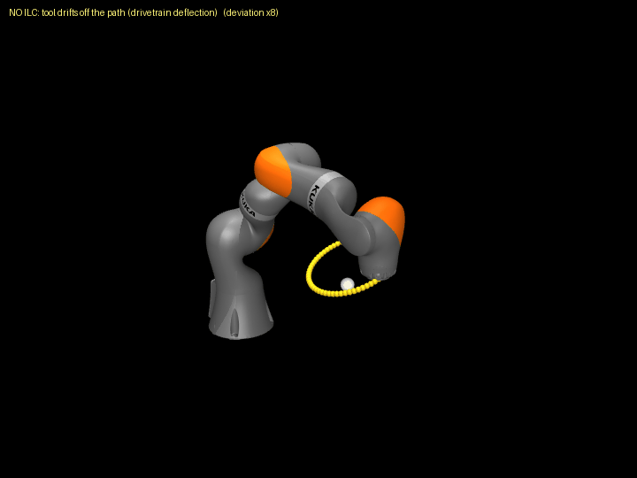 | 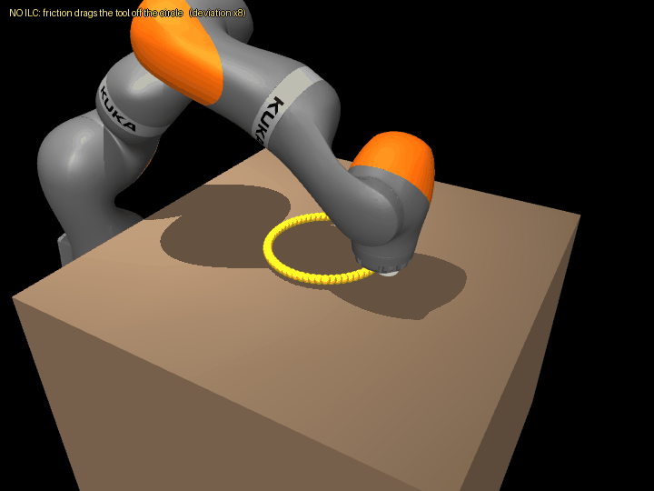 |

A 4-panel "mission-control" animation of the whole learning process (trials
0→4): the moving arm, the TCP error vs path parameter λ (past trials fading as it
collapses), the seven ILC feed-forward signals, and the convergence curve filling
in trial by trial.

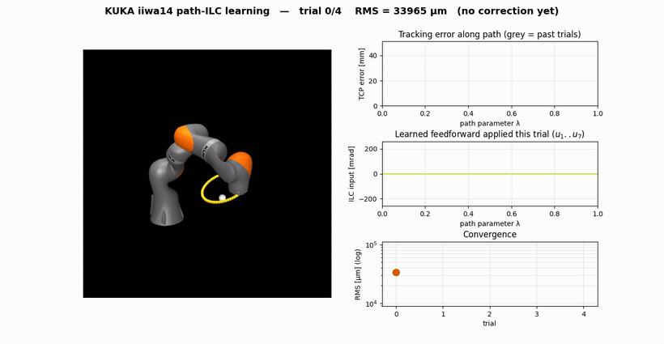

> Higher-quality MP4: [`outputs/kuka_dashboard.mp4`](outputs/kuka_dashboard.mp4).

---

## What this is, in one minute

Re-implement the path-ILC faithfully on a **real KUKA iiwa14** whose joints
are modelled as torsional **spring–mass–dampers** with realistic drivetrain
error (transmission error, Stribeck friction, backlash, thermal drift, encoder
noise). Then go past the paper on its own stated open problems:

1. **Self-learn the drivetrain error from an integrated joint-side (output)
   encoder** — the secondary encoder real high-accuracy arms carry — instead of
   an external laser tracker. `p2` validates the encoder is a faithful proxy for
   true TCP accuracy.
   (See the [sensing assumption](#the-sensing-assumption-read-this-first) — this
   is a *different, easier* sensing setup than the paper's motor-encoder-only
   robot, and I'm explicit about that.)
2. **Generalize the correction to an unseen path with zero trials** via a small
   learned model on top of the ILC (`k4`).
3. **A temperature-aware AI layer** predicts the thermal-drift compensation a
   fixed ILC table cannot (`r4`, `r5`) — the "AI-enhanced" part.

## The sensing assumption (read this first)

This is the single most important thing to understand about the demonstrator.

The paper needs a **laser tracker** for a concrete physical reason it states in
its introduction: *"significant dynamics of the robot links cannot be observed
using motor-side encoders."* The motor encoder sits **before** the elastic/geared
transmission, so it literally cannot see the transmission error — hence the
tracker.

This repo models each axis as a two-mass flexible joint (motor DOF — spring —
link DOF) and reads a **joint-side / output / secondary encoder** that observes
the **true link angle** (`kuka.read_joint_encoders()`):

```
encoder reading = motor angle + elastic deflection = true link angle
```

That sensor **directly observes the drivetrain error**, which is exactly why the
ILC can learn it without a tracker. This is a **legitimate** setup — reaching
absolute accuracy without external measurement systems is a real goal in
high-accuracy robotics, and real arms carry secondary (output) encoders for
exactly this — **but it is a stronger sensing assumption than the paper's
robot**, which only had motor encoders. The laser tracker (true TCP) is read for
**evaluation only**, never fed to the ILC.

So the honest claim is *"self-learn the drivetrain error from a joint-side output
encoder"*, **not** *"solve the paper's motor-encoder-only problem without a
tracker."* See [honest limitations](#honest-limitations) for what this does and
doesn't prove.

## Relation to the paper — what's faithful, what's new

The paper ran a path-λ PD-ILC with a Gaussian Q-filter on a real 6-axis Comau
robot, using a Leica laser tracker to learn the residual transmission/elastic
error. It achieved **95% error reduction in two trials**, reused the table across
speeds, and learned from partial trials. Its conclusion lists four **open
problems**: combine a *model-based learning filter* with the ILC, improve
*speed-variation* performance, handle *contact* tasks, and *generalize learned
data to different paths*. This repo re-implements the ILC faithfully, then targets
those.

| Aspect | Paper (ICRA 2024) | This repo |
|---|---|---|
| ILC algorithm | path-λ PD-ILC + Gaussian Q-filter (eqs. 10, 14–16, 19) | **same**, faithfully re-implemented (`src/ilc.py`) |
| Error source | real Comau drivetrain | KUKA iiwa14 with **modeled flexible joints** + optional `Effects` (TE, friction, backlash, thermal); params chosen by us |
| Sensor used **to learn** | **laser tracker** (motor encoders can't see link) | **joint-side output encoder** that reads the true link angle — a *stronger* sensor (see [above](#the-sensing-assumption-read-this-first)); tracker for eval only |
| Convergence | 95% in 2 trials | ~**32×** RMS (free-space), ~**17×** (contact) |
| Controller | computed-torque + feedforward | **position control** (weaker — explains partial speed transfer) |
| Speed transfer | near-perfect | shown but **partial** (honest) |
| Path → path transfer | *open problem* | **AI predicts a correction for an unseen path, 0 trials** — *new* |
| Model-based learning filter | *open problem* | the **learned net on top of the ILC** is exactly this — *new* |
| Contact tasks | *open problem* | **tool-on-worktable task, ILC ~17×** — *new* |
| Platform | real hardware | **simulation** |

> The headline KUKA experiments run **under realistic repeatable effects**
> (transmission error + Stribeck friction + backlash + encoder noise); the
> numbers hold up, showing robustness. Thermal drift is non-repetitive and is
> studied separately (`r4`, `r5`).

---

## Headline results

```bash
python src/main_kuka.py            # experiments 1–4  → k1–k4 (~40 s)
python src/main_kuka_contact.py    # contact task     → k5
python src/figures_kuka.py         # analysis figures → p1–p4
python src/figures_realism.py      # realistic + thermal AI → r1–r5
```

### 1. Convergence — the core result

The path-ILC converges using the joint-side output encoder only:
**34 mm → ~1.06 mm RMS (~32×)**, most of it in the first 2–3 trials, mirroring
the paper's "95% in two trials."

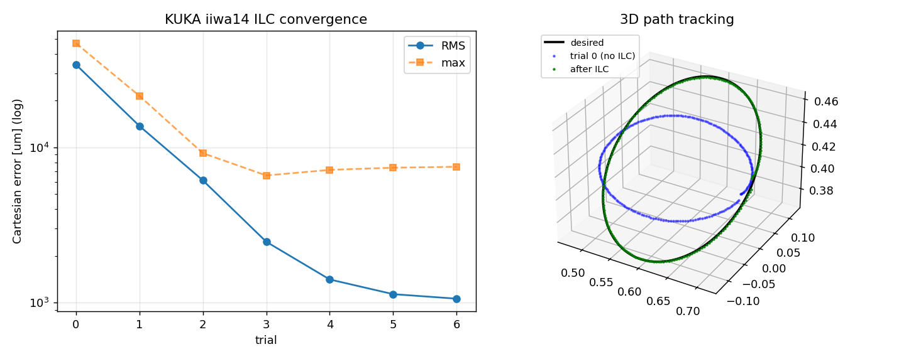

### 2. No-tracker validation (`p2`) — is this circular?

The intellectual crux. Joint-side encoder RMS and **true TCP** RMS fall in
**lock-step (corr ≈ 0.97)**, so minimising what the encoder sees also minimises
the true Cartesian accuracy → the output encoder is a faithful proxy for task
accuracy, and a laser tracker is not needed *to learn* (only to confirm this
correlation, which a real robot would do once). The second panel shows the
learned feed-forward reproducing the true drivetrain-error pattern.

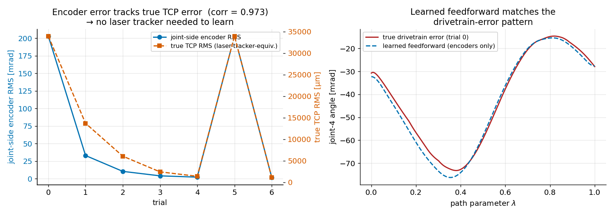

### 3. AI layer — generalize to an unseen path, zero trials (`k4`)

*The paper's "generalize to different paths" open problem (Goal 2).*
A small network is trained on ILC-converged tables for a range of path shapes,
then predicts a correction for a path it has **never seen**, with **zero trials**:
**no-corr 35 mm → naive 5.7 mm → AI-predicted 1.46 mm**. The learned layer
recovers, instantly, the accuracy classical ILC only reaches by running fresh
trials on the new path.

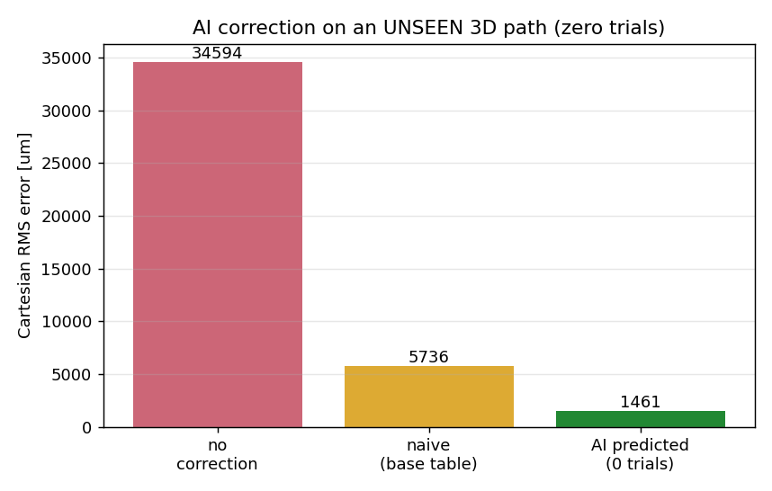

### 4. Thermal drift defeats a frozen table → needs an AI layer (`r4`, `r5`)

*The motivation for "AI on top of ILC" — the paper's "model-based learning
filter" open problem (Goal 3).* Thermal drift is
**non-repetitive**: a frozen ILC table degrades as the robot warms (`r4`), while
an online ILC tracks it. Then a **temperature-aware model** predicts the
compensation at an **unseen** thermal state with zero trials: **frozen 4.5 mm →
AI 0.99 mm ≈ oracle 1.05 mm** (`r5`).

| Frozen table fails as it warms (`r4`) | Temperature-aware AI recovers it (`r5`) |
|---|---|
| 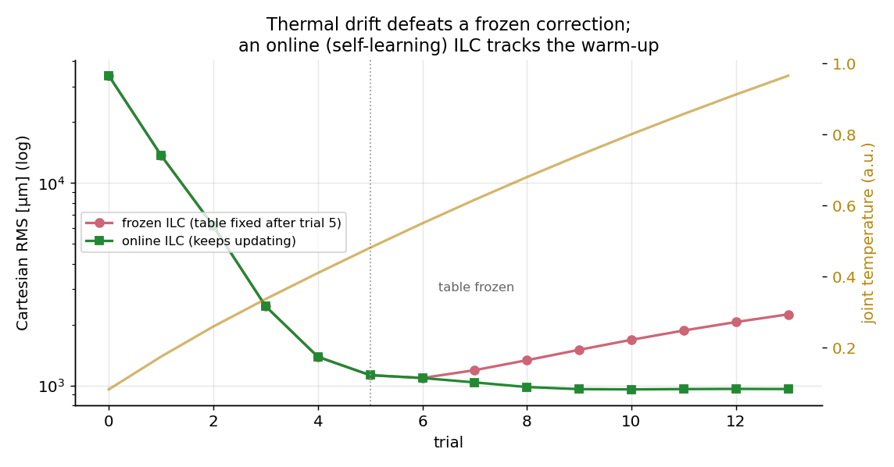 | 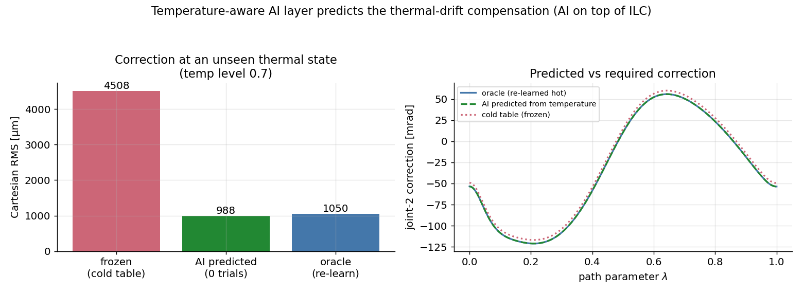 |

A live warm-up dashboard (frozen vs online RMS diverging as joint temperature
rises):

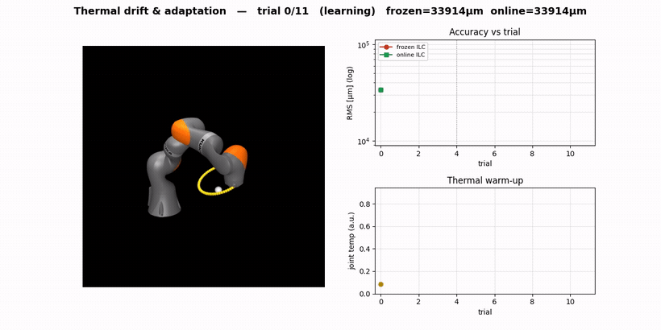

> Higher-quality MP4: [`outputs/kuka_thermal_dashboard.mp4`](outputs/kuka_thermal_dashboard.mp4).

### 5. Contact task — the paper's open problem (`k5`)

```bash
python src/main_kuka_contact.py
```

The tool tip is dragged along a circle while **pressing on a worktable (~108 N**,
from gravity on the flexible arm). Sliding friction + joint elasticity create a
repeatable in-plane disturbance, and the **same** path-ILC learns to cancel it:
**18 mm → 1.06 mm RMS (~17×)**. The max error plateaus ~9 mm at the friction
stick–slip reversal — honest: a position-indexed ILC cannot perfectly cancel a
discontinuous friction flip.

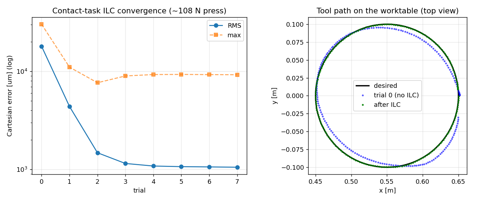

### Numbers at a glance

| Experiment | Result (Cartesian RMS at TCP) |
|---|---|
| **1. Convergence** (output encoder only) | 34156 → 1061 µm (**~32×**) |
| **2. Speed transfer** | best at trained speed (≈997 µm); partial elsewhere |
| **3. Path transfer** | no-corr 42016 → naive 14111 → relearn 1663 µm |
| **4. AI, unseen path, 0 trials** | no-corr 34594 → naive 5736 → **AI 1461 µm** |
| **5. Contact task** | 18065 → 1055 µm (**~17×**) under ~108 N press |

Numbers vary slightly run-to-run (ML + physics); reproducible on a fixed machine
with the pinned versions in `requirements.txt`.

---

<details>
<summary><b>Further analysis figures</b> (speed transfer, paper-style reproduction, vibration, realistic-effect ablations) — click to expand</summary>

### `k2` — speed transfer (honest: partial)

The path-λ table is reused at other speeds with no relearning. It beats no-ILC
everywhere but is clearly **best at the trained speed (≈0.99 mm)** — a
velocity-dependent residual a position-indexed table cannot fully cancel, which
is exactly the paper's stated open issue. (Our position controller is weaker than
the paper's computed-torque one, so this is more pronounced here.)

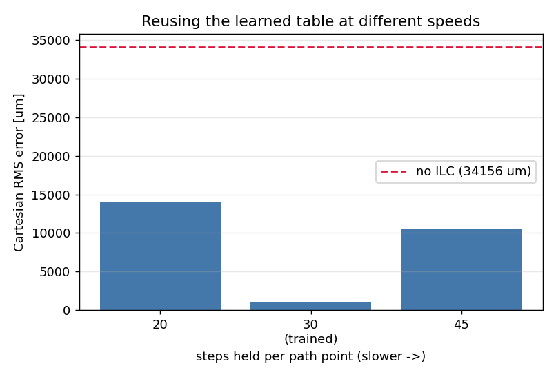

### `k3` — path transfer without the AI layer

A table learned on path A barely helps on path B; full relearning works but costs
fresh trials: **no-corr 42 mm → naive-reuse 14 mm → full relearn 1.66 mm**. This
is the gap `k4`'s AI layer closes with zero trials.

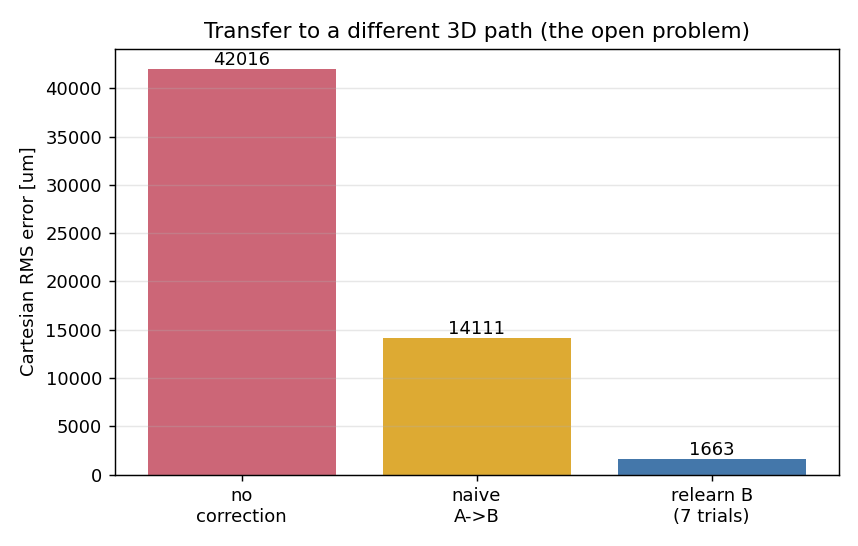

### `p1` — paper-style reproduction (the paper's Fig. 5)

TCP error components, the seven ILC input signals, and path speed over 7 trials,
with **trial 5 = ILC OFF** (error returns) and **trial 6 = ILC ON** (error
vanishes again).

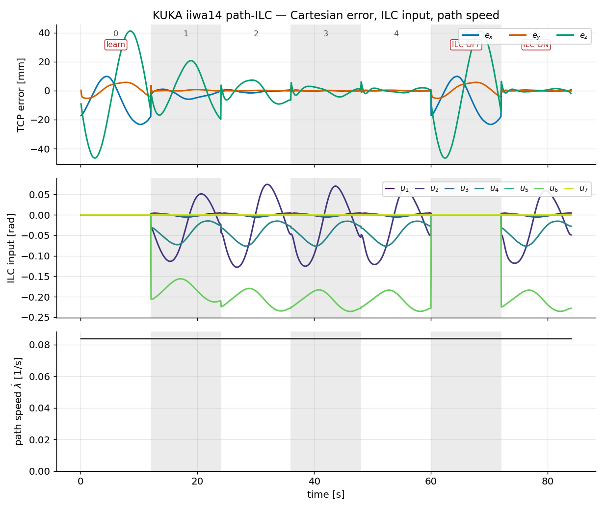

### `p3` — where the error lives along the path

Error vs path position, before vs after learning (log scale).

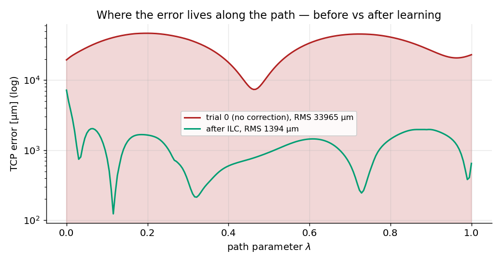

### `p4` — the mechanical-engineering view

Each joint is a torsional spring–mass–damper, with natural frequency
$f_n=\tfrac{1}{2\pi}\sqrt{K/J}$, damping ratio $\zeta=d/2\sqrt{KJ}$, the ILC
Q-filter cutoff, and a free vibration ring-down. This also explains the partial
speed transfer: faster motion excites frequencies nearer $f_n$, i.e. residual
*vibration* a position-indexed table cannot cancel.

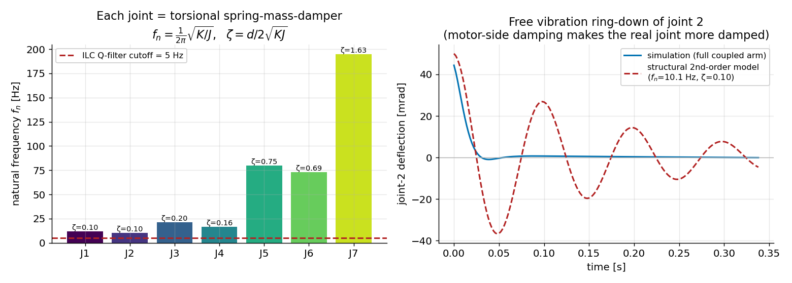

### `r1`–`r3` — realistic drivetrain effects

`kuka.Effects` adds the error sources of a real high-accuracy robot, grounded in
the literature: gear/cycloidal **transmission error**, **Stribeck friction**,
**backlash**, **thermal drift**, **encoder noise + quantization**. All OFF by
default; `Effects.realistic()` enables them.

| Figure | Point |
|---|---|
| 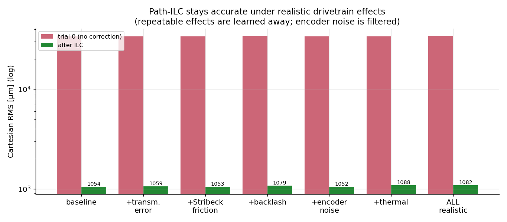 | `r1` — ILC stays ~1 mm under **every** effect (repeatable ones learned, noise filtered) |
| 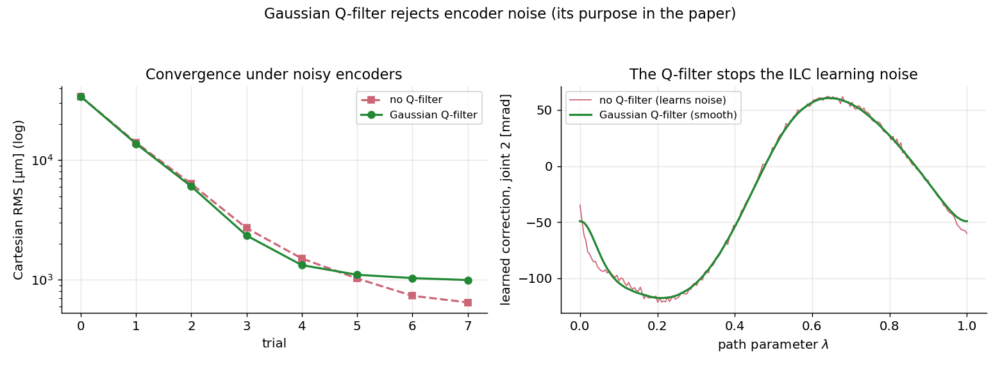 | `r2` — the Gaussian **Q-filter rejects encoder noise** (without it the correction is jagged) |
| 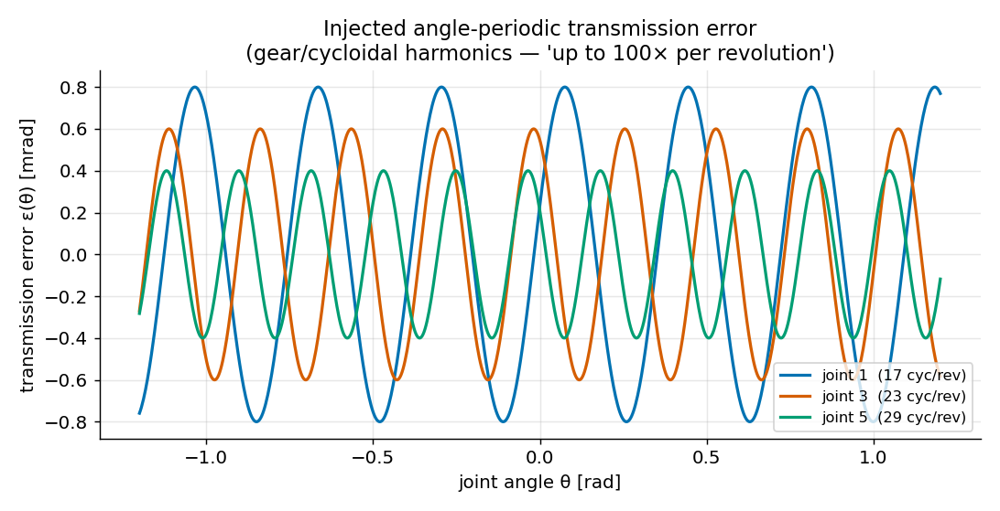 | `r3` — the injected **angle-periodic transmission error** (gear harmonics) |

</details>

<details>
<summary><b>Toy 3-DOF demonstrator</b> (quick sanity check, zero external files) — click to expand</summary>

A 3-DOF planar arm in MuJoCo, sharing the **same** ILC and AI layer as the KUKA.
The controller plans with an ideal rigid model; the plant has unmodeled friction,
gravity loading, and compliance, so the mismatch produces a repeatable path error
the ILC discovers from joint-encoder error alone. It runs in seconds and is a
good first thing to run, but the KUKA demonstrator above is the real story.

```bash
python src/main.py                 # experiments 1–4 → figures 1–4
python src/view.py                 # → outputs/arm_tracking.gif
```

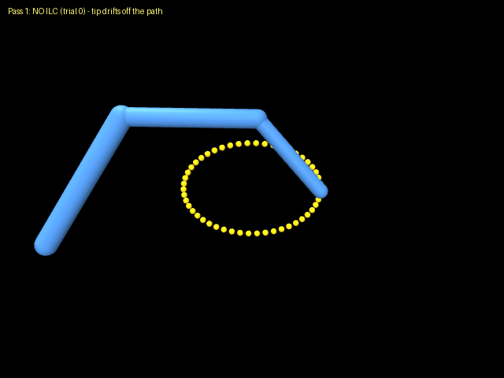

Convergence ~25× in a few trials; AI layer on an unseen path (0 trials):
52190 → naive 39999 → **AI 4165 µm**. Figures `1_convergence.png`,
`2_speed.png`, `3_transfer.png`, `4_ai_transfer.png` in `outputs/`.

</details>

---

## Honest limitations

- **It's a simulation.**
- **The sensing is generous (the key one).** The joint-side encoder reads the
  **true link angle**, i.e. it directly observes the very drivetrain error the
  ILC learns. That is what makes learning-without-a-tracker possible here. In
  reality a secondary encoder has its own noise/resolution limits, and the
  joint→task mapping has *kinematic* errors (link lengths, etc.) that a
  joint-side sensor cannot see — so a tracker is still motivated. The optional
  `kuka.Effects` realistic mode adds encoder noise + quantization, but cannot add
  the kinematic-calibration gap, which is real on hardware.
- **With a perfect real-time link encoder you could arguably use feedback**
  instead of ILC. The ILC's value here is the **reusable, path-indexed
  feed-forward** and the speed/path/AI generalization built on top — not that
  the joint error is otherwise unobservable.
- **The error source is simplified.** Real drivetrain error depends on angle,
  load, temperature, and wear in ways no fixed model fully captures — that open
  difficulty is the actual research. Here it comes from MuJoCo's
  friction/compliance/gravity plus the modeled `Effects`, whose parameters I chose.
- **Speed generalization is partial.** A position-indexed table cannot cancel a
  velocity-dependent residual, made worse by our position controller (vs the
  paper's computed-torque). The plot shows the honest behavior, not an idealized one.
- **The AI result is easy here.** With smooth paths the geometry→correction map
  is simple, so a small network suffices. The point is the *architecture and the
  experimental protocol* (train on real ILC-solved tables, test on an unseen
  geometry), not the difficulty of this instance.

---

## How to run

First-time setup:

```bash
python3 -m venv .venv && source .venv/bin/activate
pip install -r requirements.txt
```

Run **from the project root**. The `.venv` is already installed, so call its
Python directly (`.venv/bin/python ...`) or activate it once.

### Easiest — regenerate everything

```bash
.venv/bin/python src/run_all.py            # all figures + GIFs + MP4s (~4–5 min)
.venv/bin/python src/run_all.py --quick    # figures/experiments only, skip videos (~100 s)
```

### Individual pieces

```bash
python src/main_kuka.py            # KUKA headline experiments → k1–k4 (~40 s)
python src/main_kuka_contact.py    # contact task → k5
python src/figures_kuka.py         # paper-style / validation / vibration → p1–p4
python src/figures_realism.py      # realistic effects + thermal AI → r1–r5
python src/main.py                 # toy 3-DOF demo → 1–4
```

### Visuals (write a file, or `--live` for an interactive window)

```bash
python src/view_kuka.py            # → outputs/kuka_tracking.gif   (--live for a window)
python src/view_kuka_contact.py    # → outputs/kuka_contact.gif
python src/dashboard_kuka.py       # → outputs/kuka_dashboard.mp4
python src/dashboard_thermal.py    # → outputs/kuka_thermal_dashboard.mp4
python src/view.py                 # toy arm → outputs/arm_tracking.gif
```

**Notes**
- Run from the project root, **not** from inside `src/`.
- The rendering scripts (`view_*`, `dashboard_*`) need a display/GL — they
  auto-set `MUJOCO_GL=glx`. The experiment/figure scripts (`main_*`, `figures_*`)
  don't render, so they run anywhere.
- All outputs land in `outputs/`. See [`FIGURES.md`](FIGURES.md) for a one-line
  "which figure proves which claim" index with the key numbers.

---

## Files

| Path | What it is |
|---|---|
| `src/ilc.py` | the path-parameter PD-ILC with Gaussian Q-filter (paper eqs.) |
| `src/ai.py` | the small geometry→correction network |
| `src/kuka.py` | **real KUKA iiwa14** plant with flexible joints + the joint-side/motor encoders + rigid control model; `kuka.Effects` config (TE / friction / backlash / thermal / encoder noise; all OFF by default, `.realistic()` / `.realistic_repeatable()`) |
| `src/run_kuka.py` | 3D path library, IK, and the KUKA trial loop |
| `src/main_kuka.py` | KUKA experiments → figures `k1`–`k4` |
| `src/run_kuka_contact.py`, `src/main_kuka_contact.py` | contact-task setup + experiment → `k5` |
| `src/view_kuka.py`, `src/view_kuka_contact.py` | visualize the KUKA / contact task |
| `src/figures_kuka.py` | analysis figures `p1`–`p4` |
| `src/figures_realism.py` | realistic-effects figures `r1`–`r5` |
| `src/dashboard_kuka.py`, `src/dashboard_thermal.py` | real-time dashboard MP4s |
| `src/arm.py`, `src/run.py`, `src/main.py`, `src/view.py` | the toy 3-DOF demonstrator |
| `src/run_all.py` | regenerate every result in one command (`--quick` skips videos) |
| `papers/` | the reference papers |
| `FIGURES.md` | figure index / talking-points sheet (claim + number per figure) |

`MuJoCo_tutorials-main/` is a third-party MuJoCo tutorial kept only as a learning
reference; none of its files are imported — the worktable and tool are built
inline in `src/kuka.py`.
